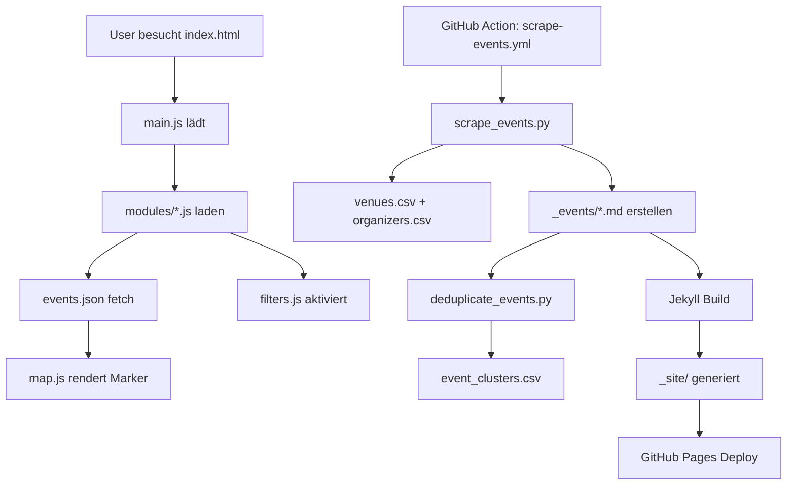

# 📦 File Registry

**"dpkg -L krawl" für dein Projekt**

Jede Datei hat einen Zweck. Dieses Dokument ist die **Single Source of Truth** für "Was macht welche Datei?".

**Last Updated:** 2025-11-20

---

## 🎯 Core System

### Event-Verwaltung
```
_events/                    # Event-Dateien (Markdown + YAML Front Matter)
├── YYYY-MM-DD-slug.md      # Einzelnes Event
└── _history/               # Archivierte Events (>30 Tage alt)
    └── YYYY-MM-DD-slug.md

_data/
├── venues.csv              # Locations (Koordinaten, Barrierefreiheit, Kontakt)
├── organizers.csv          # Veranstalter-CRM (Kontakte, Status, Social Media)
├── sources.csv             # Scraping-Quellen (URLs, Typen, Status)
├── event_clusters.csv      # Deduplizierung (merged_ids, confidence_score)
└── recurring_index.json    # Recurring Events Tracking

_layouts/
├── event.md                # Template für einzelne Event-Seiten
├── base.html               # Base Layout (SEO, PWA, Analytics)
└── map.html                # Fullscreen Map Layout
```

**Zweck:** Event-Daten + Templates für Jekyll Site Generation

---

## 🗺️ Frontend (User-Facing)

### HTML Pages
```
index.html                  # Hauptseite (Fullscreen Map + Filter)
info.html                   # About/Kontakt
admin.html                  # Admin-Panel (Draft Review, Manual Events)
404.html                    # Error Page (offline-fähig via Service Worker)
```

### JavaScript Modules
```
assets/js/
├── main.js                 # Orchestrator (lädt Module, initialisiert App)
├── modules/
│   ├── map.js              # Leaflet Map (Marker, Clustering, Popups)
│   ├── filters.js          # Filter-Logik (Radius, Zeit, Kategorie)
│   ├── events.js           # Event-Daten laden, parsen, verarbeiten
│   ├── bookmarks.js        # Bookmark-System (localStorage, PDF-Export)
│   ├── storage.js          # localStorage Wrapper (DSGVO-konform)
│   └── admin.js            # Admin-Panel Funktionalität
└── config.js               # Runtime Config (API Keys, Feature Flags)
```

### CSS Stylesheets
```
assets/css/
├── fullscreen.css          # Hauptstyle (Fullscreen Map Layout)
├── admin.css               # Admin-Panel Styles
├── popart.css              # Pop-Art Theme (optional)
└── style.css               # Fallback/Legacy
```

**Zweck:** User Interface + Interaktivität

---

## 🤖 Backend (Automation)

### Python Scripts
```
scripts/
├── scraping/
│   ├── scrape_events.py            # Multi-Source Event Scraping
│   ├── ai_flyer_analysis.py        # Flyer → Event Extraktion (GitHub Models)
│   ├── venues_manager.py           # Venue-Daten pflegen
│   └── organizers_manager.py       # Organizer-CRM Management
│
├── processing/
│   ├── deduplicate_events.py       # Fuzzy-Matching Deduplication
│   ├── enrich_events.py            # Merge beste Daten aus Duplikaten
│   ├── archive_old_events.py      # Events >30 Tage → _history/
│   └── validate_events.py          # Event-Daten validieren
│
├── admin/
│   ├── create_recurring_events.py  # Recurring Events generieren
│   ├── publish_drafts.py           # Drafts → Published
│   └── sources_watcher.py          # Überwacht sources.csv Änderungen
│
└── utils/
    ├── geocoding.py                # Adresse → Koordinaten (Nominatim)
    ├── fuzzy_match.py              # String-Matching für Dedupe
    └── date_utils.py               # Datum-Parsing + Validierung
```

**Zweck:** Event-Pipeline (Scraping → Dedupe → Enrich → Publish)

---

## 🧪 Testing & Quality

### Test Suites
```
scripts/tests/
├── test_filters.js             # Filter-System (Config → Template → JS → Logic)
├── test_documentation.js       # Docs Aktualität + Cross-References
├── package.json                # npm dependencies (js-yaml)
└── node_modules/               # Test dependencies (gitignored)
```

### Validation
```
scripts/validation/
├── validate_events.py          # Event Front Matter validieren
├── check_venues.py             # venues.csv Integrity Check
└── lint_sources.py             # sources.csv Format Check
```

**Zweck:** Code-Qualität + Daten-Integrität

---

## ⚙️ Configuration

### Jekyll Config
```
_config.yml                 # Jekyll Site Config + Feature Toggles
Gemfile                     # Ruby Dependencies (jekyll, plugins)
Gemfile.lock                # Locked Ruby Dependencies (auto-generated)
```

### Code Quality
```
eslint.config.js            # ESLint Config (JavaScript Linting)
.stylelintrc.json           # Stylelint Config (CSS Linting)
.gitignore                  # Files/Folders excluded from Git
```

### Domain & Meta
```
CNAME                       # Custom Domain (krawl.ist)
favicon.svg                 # Site Icon (SVG)
favicon.ico                 # Site Icon Fallback (ICO)
```

### Build & Deploy
```
.github/workflows/
├── scrape-events.yml       # Scheduled Scraping (täglich 6:00)
├── archive-old-events.yml  # Monthly Archivierung (1. des Monats)
├── test-filters.yml        # Filter Tests (on push)
├── validate-code.yml       # Linting + Validation (on PR)
├── monthly-tests.yml       # Comprehensive Monthly Tests
├── regenerate-docs.yml     # Auto-update Docs
├── update-docs.yml         # Doc Update Triggers
├── feature-guard.yml       # Feature Registry Check
└── jekyll.yml              # GitHub Pages Deployment

.github/
├── discussions.yml         # GitHub Discussions Config
└── ISSUE_TEMPLATE/
    └── config.yml          # Issue Template Config
```

### Environment
```
.env.example                # Template für API Keys (nicht committen!)
requirements.txt            # Python Dependencies
package.json                # Node.js Dependencies (Tests)
```

**Zweck:** Build-System + Automatisierung

---

## 🌐 Web Standards

### PWA (Progressive Web App)
```
manifest.json               # App Metadata (Icons, Theme, Display Mode)
sw.js                       # Service Worker (Offline-Caching, Auto-Update)
```

### SEO & Discovery
```
robots.txt                  # Crawler Rules (admin.html ausgeschlossen)
feed.xml                    # RSS Feed (Jekyll Feed Plugin)
sitemap.xml                 # Auto-generiert (Jekyll Sitemap Plugin)
feeds/                      # Category-spezifische RSS Feeds
```

**Zweck:** Installierbarkeit + Offline-Fähigkeit + Discoverability

---

## 📚 Documentation

### User Docs
```
README.md                   # Projekt-Übersicht, Installation, Features
INSTALL.md                  # Setup-Guide (Jekyll, Python, GitHub Actions)
FEATURES.md                 # Feature Registry (was ist wo implementiert?)
TODO.md                     # Roadmap + Known Bugs
```

### Developer Docs
```
docs/
├── PROJECT.md              # Technische Architektur, API-Referenz
├── CONTRIBUTING.md         # Contribution Guidelines, Code Style
├── ADMIN.md                # Admin-Panel Guide
├── DEDUPLICATION.md        # Dedupe-Algorithmus Erklärung
├── RECURRING_EVENTS.md     # Recurring Events System
├── VENUES.md               # Venue-Management
├── ORGANIZER_CRM.md        # Organizer-CRM Features
├── AUTOMATION.md           # GitHub Actions Workflows
└── *_QUICKREF.md           # Quick Reference Guides
```

### Meta-Docs
```
CODE_OF_CONDUCT.md          # Community Guidelines (Krawl-Style)
LICENSE                     # MIT License
CHANGELOG.md                # Release Notes
SUMMARY.txt                 # Projekt-Zusammenfassung (AI-friendly)
FILE_REGISTRY.md            # This file (File Purpose Registry)
```

**Zweck:** Onboarding + Nachschlagewerk

---

## 🗂️ Data Files

### Event Data
```
_data/
├── build_info.yml          # Build-Metadaten (Timestamp, Version)
├── event_clusters.csv      # Dedupe-Ergebnisse
├── recurring_index.json    # Recurring Events State
├── venues.csv              # Location Database
├── organizers.csv          # Veranstalter Database
└── sources.csv             # Scraping-Quellen
```

**Format:**
- `.csv` → Structured Data (Venues, Organizers, Sources)
- `.json` → Complex State (Recurring Events)
- `.yml` → Build Metadata

**Zweck:** Datenbank-Ersatz für GitHub Pages

---

## 🎨 Assets

### Images
```
assets/images/
├── favicon.svg             # Site Icon (SVG für alle Größen)
├── favicon.ico             # Fallback Icon
└── screenshots/            # Docs Screenshots
```

### Fonts (optional)
```
assets/fonts/               # Custom Fonts (falls genutzt)
```

**Zweck:** Visuelle Assets

---

## 🚮 Generated/Ignored

### Build Artifacts
```
_site/                      # Jekyll Build Output (gitignored)
.jekyll-cache/              # Jekyll Cache (gitignored)
.sass-cache/                # SASS Cache (gitignored)
node_modules/               # npm Dependencies (gitignored)
__pycache__/                # Python Cache (gitignored)
```

### Environment
```
.env                        # API Keys (gitignored)
.DS_Store                   # macOS Metadata (gitignored)
```

**Zweck:** Temp Files, nicht im Repo

---

## 📊 Dependency Graph



---

## 🔍 File Purpose Lookup

### "Ich will Feature X ändern - welche Dateien?"

| Feature | Files |
|---------|-------|
| **Radius-Filter** | `_config.yml` (Config), `index.html` (Template), `assets/js/modules/filters.js` (Logik) |
| **Event-Darstellung** | `_layouts/event.md` (Template), `assets/css/fullscreen.css` (Style) |
| **Scraping** | `scripts/scraping/scrape_events.py`, `_data/sources.csv` |
| **Deduplication** | `scripts/processing/deduplicate_events.py`, `_data/event_clusters.csv` |
| **Bookmarks** | `assets/js/modules/bookmarks.js`, `assets/js/modules/storage.js` |
| **Admin-Panel** | `admin.html`, `assets/js/modules/admin.js`, `assets/css/admin.css` |
| **PWA Offline** | `sw.js`, `manifest.json` |
| **SEO** | `_layouts/base.html` (Meta Tags), `robots.txt`, `sitemap.xml` |

### "Ich will Daten ändern - welche Files?"

| Daten-Typ | File | Format |
|-----------|------|--------|
| **Events** | `_events/*.md` | Markdown + YAML Front Matter |
| **Venues** | `_data/venues.csv` | CSV (name, address, lat, lon, wheelchair, capacity, contact) |
| **Organizers** | `_data/organizers.csv` | CSV (name, email, phone, social, status, tags) |
| **Scraping-Quellen** | `_data/sources.csv` | CSV (url, type, selector, status) |
| **Dedupe-Results** | `_data/event_clusters.csv` | CSV (cluster_id, event_ids, confidence) |

### "Ein Script schlägt fehl - wo nachschauen?"

| Script | Logs | Config |
|--------|------|--------|
| **Scraping** | GitHub Actions → scrape-events.yml | `_data/sources.csv` |
| **Archivierung** | GitHub Actions → archive-events.yml | `scripts/processing/archive_old_events.py` |
| **Deduplication** | Lokales Run: `python scripts/processing/deduplicate_events.py` | `scripts/utils/fuzzy_match.py` |
| **Jekyll Build** | GitHub Actions → deploy.yml | `_config.yml` |

---

## 🛠️ Maintenance Checklist

### Regelmäßig prüfen:
- [ ] `FEATURES.md` → Last Updated aktuell?
- [ ] `TODO.md` → Erledigte Tasks haben Datum?
- [ ] `_data/sources.csv` → Alle Quellen noch erreichbar?
- [ ] `_data/venues.csv` → Koordinaten korrekt?
- [ ] `scripts/tests/` → Alle Tests passing?

### Bei neuem Feature:
- [ ] Code schreiben
- [ ] `FEATURES.md` updaten
- [ ] Test schreiben (`scripts/tests/`)
- [ ] `README.md` erwähnen
- [ ] Dieses File (`FILE_REGISTRY.md`) updaten

---

## 🔧 Tools zum Validieren

```bash
# Alle Tests laufen lassen
node scripts/tests/test_filters.js
node scripts/tests/test_documentation.js

# File-Registry prüfen
find . -type f ! -path './_site/*' ! -path './node_modules/*' ! -path './.git/*' | wc -l

# Welche Files sind nicht dokumentiert?
comm -23 \
  <(find . -type f ! -path './_site/*' ! -path './node_modules/*' ! -path './.git/*' | sort) \
  <(grep -h "^\S" FILE_REGISTRY.md | sort)
```

---

## 💡 Philosophie

**"No files left behind!"**

Jede Datei in diesem Repo hat einen Zweck. Wenn du eine neue Datei erstellst:
1. Frag dich: **Warum braucht Krawl das?**
2. Dokumentiere es hier
3. Verlinke es in anderen Docs (README, FEATURES, etc.)

Wenn eine Datei keinen Zweck mehr hat:
1. **Lösch sie**
2. Update dieses File
3. Commit mit Begründung

**Kein Code-Friedhof. Kein Legacy-Chaos. Jede Datei zählt.**

---

## 📦 TL;DR: Package Manager Style

```bash
# "dpkg -L krawl" für Krawl

# Core System
_events/              # Event Database
_data/                # CSV/JSON Data Store
_layouts/             # Jekyll Templates

# Frontend
index.html            # Main App
assets/js/modules/    # JavaScript Modules
assets/css/           # Stylesheets

# Backend
scripts/scraping/     # Event Collection
scripts/processing/   # Data Pipeline
scripts/admin/        # Admin Tools

# Testing
scripts/tests/        # Test Suites
scripts/validation/   # Data Validation

# Config
_config.yml           # Jekyll Config
.github/workflows/    # CI/CD

# Docs
README.md             # Start here
docs/                 # Deep dives
FILE_REGISTRY.md      # This file (Meta!)
```

**Krawl ist transparent. Keine versteckten Dateien. Kein Rätselraten.**
