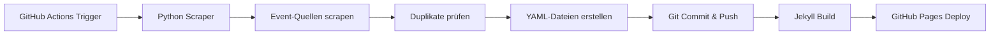
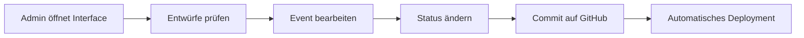
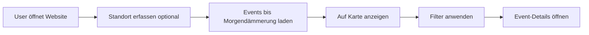

# 📊 Projekt-Übersicht: Event-Kalender Hof

**Letzte Aktualisierung:** 19. November 2025  
**Version:** v1.7.0  
**Status:** 🟢 Production Ready

## 📅 Projekt-Timeline

**🎬 Projektstart:** 17. November 2025, 21:46 Uhr (Initial Commit)

### Entwicklungsgeschichte

| Datum | Version | Milestone | Entwicklungszeit |
|-------|---------|-----------|------------------|
| **17.11.2025** | **v0.1.0** | 🚀 Pre-Release | 0 Tage (21:46 Uhr) |
| **17.11.2025** | **v1.0.0** | 🎉 First Release | < 1 Tag |
| **18.11.2025** | **v1.1.0** | 🎨 Design-Refactoring | +1 Tag |
| **18.11.2025** | **v1.2.0** | 🖼️ AI-Flyer-Analyse | +1 Tag |
| **19.11.2025** | **v1.3.0** | 🏛️ Venue-Management | +2 Tage |
| **19.11.2025** | **v1.4.0** | ✅ Datums-Validierung | +2 Tage |
| **19.11.2025** | **v1.5.0** | 🔄 Recurring Events | +2 Tage |
| **19.11.2025** | **v1.6.0** | ⚡ Auto-Scraping | +2 Tage |
| **19.11.2025** | **v1.7.0** | 📌 Bookmark-System | +2 Tage |

**Gesamt:** 8 Versionen in 3 Tagen | **25+ Major Features** | **3-4 Features/Tag**

### Feature-Entwicklung

- **Tag 0 (17.11.):** MVP → Production (Core Features)
- **Tag 1 (18.11.):** Design + AI (4 Features)
- **Tag 2 (19.11.):** Quality + Automation + UX (12 Features)

> 📖 **Details:** Siehe [CHANGELOG.md](CHANGELOG.md) für vollständige Entwicklungs-Timeline

## Zusammenfassung

## 📊 Projekt-Statistiken

**Stand:** 19. November 2025, 20:27 Uhr

### Events
- **Gesamt:** 17 Events
- **Veröffentlicht:** 15
- **Entwürfe:** 2
- **Archiviert:** 0
- **Wiederkehrend:** 4

### Datenquellen
- **Scraping-Quellen:** 8
- **Veranstaltungsorte:** 5
- **Standorte:** 4

### Code-Metriken
- **Python:** 3,409 Zeilen
- **JavaScript:** 882 Zeilen
- **CSS:** 992 Zeilen
- **HTML:** 556 Zeilen
- **Markdown (Docs):** 4,153 Zeilen
- **Gesamt:** 9,992 Zeilen

### Repository
- **Commits:** 123
- **Letzter Commit:** `77046a2`

Der Event-Kalender Hof ist eine Jekyll-basierte Website für GitHub Pages, die automatisch Events aus verschiedenen Quellen sammelt und auf einer interaktiven Karte darstellt. Das Besondere: Es werden nur Events bis zur Morgendämmerung angezeigt - perfekt für spontane Abendplanungen!

**Live-URL:** https://feileberlin.github.io/event-kalender-hof/

## 🎯 Kernfunktionen

### 1. Interaktive Event-Karte
- **Technologie**: Leaflet.js 1.9.4 + OpenStreetMap Tiles
- **Zentrum**: Rathaus Hof an der Saale (50.3197, 11.9168)
- **Features**: 
  - Rathaus-Marker immer sichtbar (auch ohne Events)
  - Automatische Event-Marker mit farbigen Icons
  - Click-to-focus Funktionalität
  - Responsive: 300px (Mobile) → 500px (Desktop)
  - Geolocation-Unterstützung mit Fehlerbehandlung
  - z-index: 999-1001 für korrekte Layering

### 2. Intelligente Zeitfilterung
- **"Bis Sonnenaufgang"**: Zeigt nur Events bis 6:30 Uhr am Folgetag
- **Dawn-Berechnung**: Dynamisch basierend auf aktueller Uhrzeit
- **Zusätzliche Filter**: Heute, Morgen, Nächste 6 Stunden
- **Radius-Filter**: 1-10 km Umkreis (wenn Standort verfügbar)

### 3. Automatisches Event-Scraping
- **GitHub Actions**: Täglich um 6:00 und 18:00 UTC
- **Duplikatsprüfung**: MD5-Hash aus Titel+Datum+Zeit+Ort
- **Status-System**: Entwurf → Öffentlich
- **Quellen**: 
  - Stadt Hof
  - Freiheitshalle Hof
  - Galeriehaus Hof (Facebook)
  - Vanishing Walls (Facebook)
  - Punkrock in Hof (Facebook)

### 4. Admin-Interface (admin.html)
- Übersicht aller Events (inkl. Entwürfe)
- Status-Verwaltung (Entwurf ↔ Öffentlich)
- **Neues Event erstellen** mit vollständigem Formular
- **Recurring Events Support**: 
  - by_set_pos Dropdown (Erster/Zweiter/.../Letzter Wochentag)
  - additions/exceptions Editor mit visuellen Pills
  - Wochentags-Checkboxen (mehrere gleichzeitig)
  - Live-Vorschau der nächsten 10 Termine
  - Markdown-Generator für YAML-Frontmatter
- Direktlink zu GitHub Editor

### 5. Bookmark-System (v1.7.0)
- **Event-Markierung**: ☆/⭐ Button in Cards und Karten-Popups
- **Cookie-Speicherung**: Nur URLs (DSGVO-konform, 365 Tage)
- **Visuelle Hervorhebung**: Grüner Rahmen + ⭐-Symbol
- **Toolbar am Bildrand**: Erscheint nur bei vorhandenen Bookmarks
- **🖨️ Druck-Funktion**: Formatierte PDF-druckbare Liste
- **📧 E-Mail-Funktion**: Mailto-Link mit vorausgefülltem Body
- **🗑️ Löschen-Funktion**: Alle Bookmarks auf einmal entfernen
- **Automatische Validierung**: Nur veröffentlichte + zukünftige Events
- **Responsive Design**: Desktop (rechts) / Mobile (unten rechts)

### 6. Automatische Tests
- **Filter-Tests**: Validiert HTML ↔ JavaScript Konsistenz
- **CI/CD Integration**: Tests laufen bei jedem relevanten Push
- **Test Suite**: `tests/test_filters.js` mit 4 Test-Kategorien:
  1. HTML Radius-Optionen validieren
  2. JavaScript Filter-Logik prüfen
  3. Distanzberechnung simulieren
  4. Edge Cases testen
- **Workflow**: `.github/workflows/test-filters.yml`

## 📁 Dateistruktur

```
event-kalender-hof/
├── 📄 Konfiguration
│   ├── _config.yml           # Jekyll-Config
│   ├── Gemfile               # Ruby-Gems
│   ├── requirements.txt      # Python-Packages
│   └── .gitignore            # Git-Ignore
│
├── 🎨 Layouts & Templates
│   ├── _layouts/
│   │   ├── popart.html       # Haupt-Layout (37 Zeilen, minimalistisch)
│   │   └── event.html        # Event-Details (nutzt popart)
│   ├── index.html            # Hauptseite
│   └── admin.html            # Admin-Interface
│
├── 💎 Assets
│   ├── assets/css/
│   │   ├── style.css         # Haupt-Stylesheet (566 Zeilen)
│   │   └── popart.css        # Layout-spezifische Styles
│   └── assets/js/
│       └── main.js           # JavaScript-Logik (439 Zeilen)
│
├── 📅 Content
│   └── _events/              # Event-Markdown-Dateien
│       ├── 2025-11-18-beispiel-konzert.md
│       ├── 2025-11-25-jazz-night-in-der-freiheitshalle.md
│       └── 2025-12-15-weihnachtsmarkt-hof.md
│
├── 🤖 Automation
│   ├── .github/workflows/
│   │   ├── jekyll.yml        # Build & Deploy
│   │   ├── scrape-events.yml # Auto-Scraping
│   │   ├── test-filters.yml  # Filter-Tests
│   │   └── update-docs.yml   # Doku-Prüfung
│   └── scripts/
│       └── scrape_events.py  # Event-Scraper (330 Zeilen)
│
├── 🧪 Tests
│   ├── tests/
│   │   ├── test_filters.js   # Filter-Konsistenz Tests
│   │   └── README.md         # Test-Dokumentation
│
├── 📚 Dokumentation
│   ├── README.md             # Hauptdokumentation (900+ Zeilen)
│   ├── QUICKSTART.md         # Schnellstart
│   ├── CONTRIBUTING.md       # Contribution Guide
│   ├── CHANGELOG.md          # Änderungsprotokoll
│   ├── CODE_OF_CONDUCT.md    # Code of Conduct
│   └── LICENSE               # MIT-Lizenz
│
└── 🛠️ Tools
    ├── scripts/setup.sh      # Setup-Skript
    └── dev.sh                # Dev-Server-Skript
```

## 🔧 Technischer Stack

### Frontend
| Technologie | Version | Zweck |
|------------|---------|-------|
| Jekyll | 4.3 | Static Site Generator |
| Skeleton CSS | 2.0.4 | Responsive Grid Framework (Mobile-First) |
| Normalize CSS | 8.0.1 | Browser CSS Reset |
| Leaflet.js | 1.9.4 | Kartenvisualisierung |
| JavaScript | ES6+ | Interaktivität (Vanilla, keine jQuery) |
| HTML5 | - | Struktur |

### Backend/Automation
| Technologie | Version | Zweck |
|------------|---------|-------|
| Python | 3.11+ | Scraping & Automation |
| BeautifulSoup4 | 4.12+ | HTML-Parsing |
| PyYAML | 6.0+ | YAML-Verarbeitung |
| Requests | 2.31+ | HTTP-Requests |

### CI/CD
| Service | Zweck |
|---------|-------|
| GitHub Actions | Automatisierung |
| GitHub Pages | Hosting |

## 📊 Datenmodell

### Event-Struktur (YAML)

```yaml
title: String         # Event-Titel (Pflicht)
date: Date           # YYYY-MM-DD (Pflicht)
start_time: String   # HH:MM (Pflicht)
end_time: String     # HH:MM (Optional)
location: String     # Ort (Pflicht)
address: String      # Vollständige Adresse (Optional)
coordinates:         # GPS-Koordinaten (Pflicht)
  lat: Float
  lng: Float
category: String     # Kategorie (Optional)
tags: Array          # Tags (Optional)
description: String  # Beschreibung (Optional)
url: String          # Externe URL (Optional)
image: String        # Bild-URL (Optional)
status: String       # "Entwurf" oder "Öffentlich" (Pflicht)
source: String       # Datenquelle (Optional)
event_hash: String   # Hash für Duplikatsprüfung (Optional)
```

### Kategorien

1. 🎵 **Musik** - Konzerte, Festivals, Live-Musik
2. 🎭 **Theater** - Schauspiel, Kabarett, Comedy
3. ⚽ **Sport** - Sportveranstaltungen, Turniere
4. 🎨 **Kultur** - Ausstellungen, Lesungen, Kunst
5. 🛒 **Markt** - Wochenmärkte, Flohmärkte
6. 🎉 **Fest** - Stadtfeste, Volksfeste
7. 📅 **Sonstiges** - Andere Events

## 🔄 Workflows

### Automatisches Scraping



**Frequenz**: Täglich 6:00 & 18:00 UTC  
**Status**: Neue Events als "Entwurf"

### Admin-Workflow



### User-Experience



## 📈 Performance-Metriken

### Geschwindigkeit
- **Build-Zeit**: ~30 Sekunden (Jekyll)
- **Deployment**: ~2 Minuten (GitHub Actions)
- **Seitenladezeit**: <2 Sekunden
- **Kartenladezeit**: <1 Sekunde

### Kapazität
- **Max Events**: Unbegrenzt (Jekyll-Collection)
- **Scraping-Rate**: 10-20 Events pro Durchlauf
- **Speicherbedarf**: ~1 MB pro 100 Events

## 🔒 Sicherheit

### Authentifizierung
- **Admin**: GitHub OAuth (implizit)
- **User**: Keine Anmeldung erforderlich

### Daten
- **Keine persönlichen Daten** gespeichert
- **Geolocation**: Nur temporär im Browser
- **Cookies**: Keine (rein statisch)

### Dependencies
- Automatische Updates via Dependabot
- Security-Scanning via GitHub

## 🎨 Design-System

### Farbpalette

```css
--primary-color: #2c3e50    /* Dunkelblau */
--secondary-color: #8b4513  /* Braun */
--accent-color: #ffaa33     /* Orange/Gold */
--background: #f8f9fa       /* Hellgrau */
```

### Typografie
- **Primär**: Segoe UI, Tahoma, Geneva
- **Größen**: 14px (Body), 16-32px (Headlines)
- **Gewichte**: 400 (Normal), 600 (Semi-Bold), 700 (Bold)

### Komponenten
- Event-Karten (Cards)
- Filter-Leisten
- Modals
- Buttons (Primary, Secondary, Small)
- Badges (Status, Kategorie, Tags)

## 🚀 Deployment

### GitHub Pages
1. **Build**: Jekyll kompiliert Markdown → HTML
2. **Deploy**: GitHub Actions pusht zu gh-pages Branch
3. **Serve**: GitHub Pages hostet statische Files

### Custom Domain (optional)
1. CNAME-Datei erstellen
2. DNS-Einträge setzen
3. HTTPS automatisch via Let's Encrypt

## 📊 Monitoring & Analytics (optional)

### Google Analytics Integration

```html
<!-- In _layouts/default.html -->
<script async src="https://www.googletagmanager.com/gtag/js?id=GA_ID"></script>
<script>
  window.dataLayer = window.dataLayer || [];
  function gtag(){dataLayer.push(arguments);}
  gtag('js', new Date());
  gtag('config', 'GA_ID');
</script>
```

### Plausible Analytics (Privacy-friendly)

```html
<script defer data-domain="yourdomain.com" src="https://plausible.io/js/script.js"></script>
```

## 🔮 Roadmap

### v1.8.0 (geplant)
- [ ] LocalStorage statt Cookies (größere Kapazität)
- [ ] Bookmark-Kategorien/Tags
- [ ] Bookmark-Sortierung (Datum, Kategorie, Alphabet)
- [ ] iCal/Calendar-Export (.ics-Dateien)

### v1.9.0 (geplant)
- [ ] RSS-Feed für Events
- [ ] PWA-Support (Service Worker, Offline-Modus)
- [ ] Sync mit Google Calendar / Outlook
- [ ] Teilen-Funktion (Link zu Bookmark-Liste)

### v2.0.0 (geplant)
- [ ] Dark Mode
- [ ] Account-System (optional, für Cross-Device Sync)
- [ ] Bookmark-Statistiken & Analytics
- [ ] Event-Empfehlungen basierend auf Bookmarks
- [ ] KI-gestützte Event-Beschreibungen
- [ ] Social Media Integration
- [ ] Mehrsprachigkeit (EN/DE)

## 📞 Support

- **Issues**: [GitHub Issues](https://github.com/feileberlin/event-kalender-hof/issues)
- **Discussions**: [GitHub Discussions](https://github.com/feileberlin/event-kalender-hof/discussions)
- **Dokumentation**: [../README.md](../README.md)

## 📜 Lizenz

MIT License - Siehe [LICENSE](../LICENSE)

---

**Stand**: 19. November 2025  
**Version**: v1.7.0  
**Maintainer**: feileberlin
